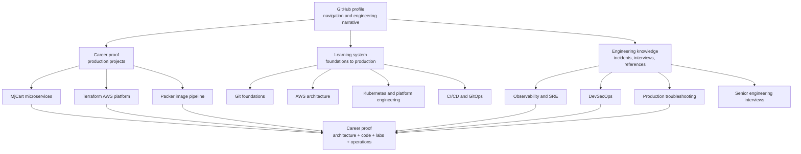

# jeevanm84 — AWS, DevOps, Platform Engineering & SRE

<p align="center">
  <strong>Senior Infrastructure / DevOps Engineer</strong><br>
  Building reliable cloud platforms, delivery pipelines, infrastructure automation, and production operations guidance.
</p>

<p align="center">
  <a href="https://github.com/jeevanm84"></a>
  <a href="https://linkedin.com/in/jeevanm84"></a>
  
</p>

## Engineering profile

Infrastructure, cloud, DevOps, and SRE practitioner with 18+ years of experience across systems engineering, automation, cloud platforms, reliability, and production operations. This profile is an open engineering portfolio: every featured repository is designed to demonstrate working code, architecture decisions, operational trade-offs, troubleshooting, or reusable learning value.

Primary focus:

- AWS cloud and Well-Architected system design
- Terraform, immutable infrastructure, and platform automation
- Kubernetes, containers, CI/CD, and GitOps
- Monitoring, observability, SLOs, and incident response
- DevSecOps and software supply-chain security
- Production troubleshooting and cost-conscious engineering

## Portfolio architecture



The full repository hierarchy, publication standards, and roadmap are documented in [GitHub Engineering Ecosystem](docs/ECOSYSTEM.md).

## Featured engineering projects

| Repository | Engineering outcome | Evidence |
|---|---|---|
| [mjcart-ecommerce-microservices](https://github.com/jeevanm84/mjcart-ecommerce-microservices) | Production-oriented e-commerce microservices capstone | Services, containers, AWS, Terraform, CI/CD, architecture and operational documentation |
| [aws-well-architected-production-labs](https://github.com/jeevanm84/aws-well-architected-production-labs) | Scenario-driven AWS architecture and trade-off analysis | Five assessed systems, six-pillar evidence, failure modes, RTO/RPO, cost decisions and interview scenarios |
| [terraform-aws-ha-web-platform](https://github.com/jeevanm84/terraform-aws-ha-web-platform) | Secure two-AZ AWS web platform with cost-aware and resilience profiles | Reusable Terraform modules, mock tests, OIDC, state protection, manual deployment and cleanup |
| [packer-aws-golden-image-pipeline](https://github.com/jeevanm84/packer-aws-golden-image-pipeline) | Immutable-image pipeline from local learning to optional AWS AMIs | Packer, Docker, Terraform, validation, GitHub OIDC and lifecycle controls |
| [kubernetes-zero-to-production](https://github.com/jeevanm84/kubernetes-zero-to-production) | Local-first Kubernetes platform and production reasoning path | Secure manifests, Kustomize, Kind runtime proof, schema/policy CI, troubleshooting and EKS architecture |
| [git-command-master-map](https://github.com/jeevanm84/git-command-master-map) | Safety-first Git practice and recovery system | Visual map, isolated sandboxes, conflicts, reflog recovery, bisect and team workflows |

## Engineering roadmap

Repositories are published only when they contain working technical material, an end-to-end guide, validation, security guidance, troubleshooting, and meaningful hands-on exercises.

| Stage | Repository | Status |
|---:|---|---|
| 1 | [git-command-master-map](https://github.com/jeevanm84/git-command-master-map) | Published |
| 2 | [aws-well-architected-production-labs](https://github.com/jeevanm84/aws-well-architected-production-labs) | Published |
| 3 | [terraform-aws-ha-web-platform](https://github.com/jeevanm84/terraform-aws-ha-web-platform) | Published |
| 4 | [packer-aws-golden-image-pipeline](https://github.com/jeevanm84/packer-aws-golden-image-pipeline) | Published |
| 5 | [kubernetes-zero-to-production](https://github.com/jeevanm84/kubernetes-zero-to-production) | Published |
| 6 | `cicd-gitops-platform-engineering` | Planned |
| 7 | `observability-sre-engineering-lab` | Planned |
| 8 | `devsecops-software-supply-chain` | Planned |
| 9 | `production-troubleshooting-handbook` | Planned |
| 10 | [mjcart-ecommerce-microservices](https://github.com/jeevanm84/mjcart-ecommerce-microservices) | Published capstone |
| Cross-stage | `devops-sre-interview-playbook` | Planned |

```text
Linux and Git
  → AWS
  → Terraform
  → Docker and Packer
  → Kubernetes
  → CI/CD and GitOps
  → Observability and SRE
  → DevSecOps
  → Production troubleshooting
  → MjCart capstone platform
```

## Technology stack

| Domain | Technologies and practices |
|---|---|
| Cloud | AWS VPC, EC2, Auto Scaling, ALB, RDS, S3, IAM, Systems Manager, CloudWatch |
| Infrastructure as code | Terraform, Packer, CloudFormation, Ansible |
| Containers and platforms | Docker, Kubernetes, EKS, Helm, GitOps |
| Delivery | GitHub Actions, Jenkins, GitLab CI, release governance, OIDC |
| Observability | Prometheus, Grafana, Loki, ELK, Alertmanager, CloudWatch |
| Reliability | High availability, SLOs, incident response, capacity and disaster recovery |
| Security | Least privilege, short-lived identity, secret protection, scanning and supply-chain controls |
| Automation | Bash, Python, reusable workflows and operational runbooks |

## Architecture and operations portfolio

Each technical project follows a common engineering narrative:

```text
Problem → Requirements → Architecture → Implementation → Deployment
→ Security → High Availability → Scalability → Observability
→ Disaster Recovery → Cost Optimization → Troubleshooting → Lessons Learned
```

The shared documentation contract is available in [Repository Standards](docs/REPOSITORY_STANDARDS.md).

## Certifications

- AWS Solutions Architect – Associate
- HashiCorp Certified: Terraform Associate
- Red Hat Enterprise Linux 7
- Kubernetes Administrator
- Microsoft Azure Administrator (AZ-104)
- Google Cloud Professional certification
- Oracle Solaris System Administrator

## Current engineering focus

- Extending the published AWS architecture evidence into delivery, observability, and security systems
- Designing CI/CD, GitOps, observability and SRE repositories around reusable engineering evidence
- Connecting infrastructure, delivery, observability, security, and incident response into one capstone platform
- Publishing production reasoning—not only successful deployment steps

## GitHub activity

<p align="center">
  
  
</p>

## Connect and collaborate

- Follow [@jeevanm84](https://github.com/jeevanm84) for new AWS, DevOps, platform engineering, and SRE projects.
- Connect through [LinkedIn](https://linkedin.com/in/jeevanm84).
- Use repository Discussions for learning questions and Issues for reproducible defects or improvement proposals.

Reference forks are retained for study but are intentionally separated from the original engineering portfolio.
