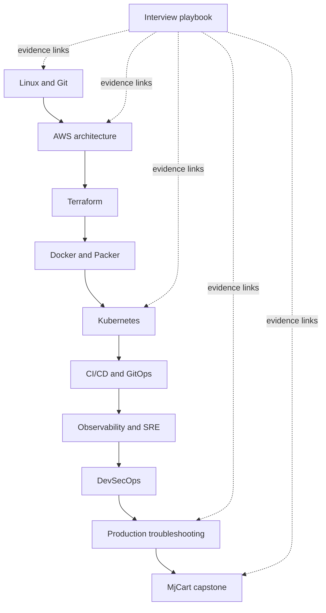

# GitHub engineering ecosystem

## Mission

The `jeevanm84` GitHub account is organized as an engineering portfolio, progressive learning roadmap, operational knowledge base, and evidence library for multi-cloud engineering, DevOps, platform engineering, SRE, and DevSecOps.

The objective is not repository volume. The target is approximately 8–12 substantial original repositories that each demonstrate engineering capability, architecture knowledge, reusable automation, production troubleshooting, or durable educational value.

## Portfolio hierarchy

```text
jeevanm84 profile
├── Flagship production project
│   └── mjcart-ecommerce-microservices
├── Multi-cloud architecture and infrastructure
│   ├── aws-well-architected-production-labs
│   ├── terraform-aws-ha-web-platform
│   ├── packer-aws-golden-image-pipeline
│   ├── Azure production project (publish after validation)
│   └── Google Cloud production project (publish after validation)
├── Platform engineering
│   ├── kubernetes-zero-to-production
│   └── cicd-gitops-platform-engineering
├── Operations and security
│   ├── observability-sre-engineering-lab
│   ├── devsecops-software-supply-chain
│   └── production-troubleshooting-handbook
└── Knowledge and career
    ├── devops-sre-interview-playbook
    └── git-command-master-map
```

## Repository responsibilities

| Repository | Primary responsibility | Must not become |
|---|---|---|
| `mjcart-ecommerce-microservices` | Integrated production-oriented capstone | A disconnected collection of infrastructure examples |
| `aws-well-architected-production-labs` | Scenario-driven AWS architecture decisions | A service-definition encyclopedia |
| `terraform-aws-ha-web-platform` | Tested infrastructure-as-code implementation | A copy of Terraform documentation |
| `packer-aws-golden-image-pipeline` | Immutable image lifecycle and validation | A single untested template |
| `kubernetes-zero-to-production` | Local-first platform and failure labs | A directory of unexplained YAML |
| `cicd-gitops-platform-engineering` | Reusable secure delivery and promotion | Vendor-specific screenshots without executable workflows |
| `observability-sre-engineering-lab` | Telemetry, SLO, alert and capacity experiments | A dashboard gallery without operational questions |
| `devsecops-software-supply-chain` | Threat-led delivery controls | A list of scanners |
| `production-troubleshooting-handbook` | Reproducible incident investigation and prevention | Unverified command snippets |
| `devops-sre-interview-playbook` | Progressive questions linked to engineering evidence | Memorized one-line answers |
| `git-command-master-map` | Safe Git practice and recovery | Only a static cheat sheet |

## Learning and evidence flow



## Publication gate

A new repository is made public only when it has:

- A professional README with a clear problem and outcome
- Working implementation, lab, automation, or substantial technical content
- One end-to-end path with prerequisites, checkpoints, verification, and cleanup
- Architecture or workflow diagrams
- Automated validation proportional to the technology
- Security and secret-handling guidance
- Cost controls when cloud services are involved
- At least one failure or troubleshooting scenario
- Community, contribution, and vulnerability-reporting files
- A clean identity and secret scan
- Passing CI, discovery topics, and protected `main`

Empty placeholder repositories are not published.

## Portfolio navigation contract

Every repository README contains:

1. Its position in the learning roadmap
2. Prerequisite and successor repositories
3. Links to its end-to-end guide, architecture, troubleshooting, and interview material
4. A link back to the `jeevanm84` profile
5. A clear distinction between local/offline and billable cloud exercises

## Original work and references

Original repositories are featured and eligible for profile pins. Forks and external course repositories are retained in a separate reference section and are not presented as original portfolio work.

## Recommended profile pins

1. `mjcart-ecommerce-microservices`
2. `aws-well-architected-production-labs`
3. `terraform-aws-ha-web-platform`
4. `kubernetes-zero-to-production`
5. `observability-sre-engineering-lab`
6. `production-troubleshooting-handbook`

Until planned repositories meet the publication gate, the strongest existing original repositories should occupy those positions.
